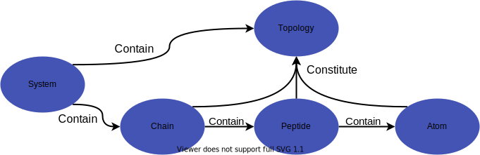

===================
openpd.core package
===================

Package Overview
================

The ``openpd.core`` package is designed to represent the simulation system. Naturally, a typical protein system contains one or several chains, which consist of many peptides. And the peptides are constituted by atoms. Further, the atoms' connection will form the topology of the whole system.

Following this fact, the ``openpd.core`` package is designed as below:

-----------------------------

-----------------------------

The ``System`` is the final model that we will use to create a ``Simulation``. Usually, the creation of a ``System`` can be automatically done by a ``loader`` in ``openpd.loader`` package.

.. seealso::

    - :doc:`../../quick_start/intro` page
    - :doc:`../simulation` page
    - :doc:`../../tutorials/howto_createSystem/main` page
    - :doc:`../loader/main` page

Package indices
================

.. toctree::
    :maxdepth: 1

    atom 
    peptide
    chain
    system
    topology