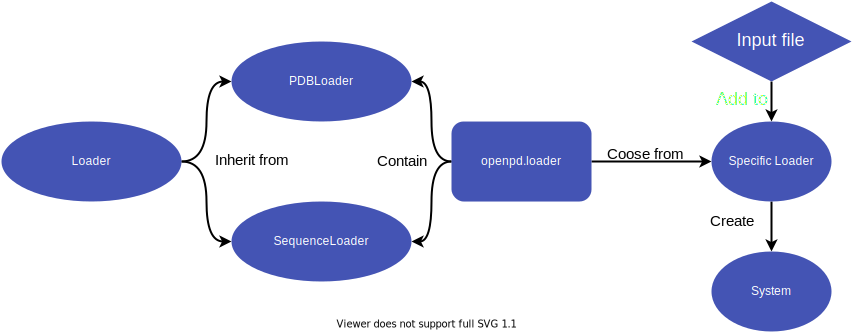

=====================
openpd.loader package
=====================

Package introduction
====================

As the creation of ``System`` is tedious but multistep work, OpenPD provides a package to automatically finish creating a ``System`` from an input file, which is ``openpd.loader`` package. 

.. seealso:: :doc:`../core/system` Page

The workflow of ``openpd.loader`` is quite straight-forward as shown below:

-------------------------

-------------------------

Currently, two ``loader`` classes that inherit from ``openpd.loader.Loader`` are provided:

- ``PDBLoader``: Creating system from a *.pdb* file.
- ``SequenceLoader``: Creating system from a *.json* file.

We think these two loaders cover most of the requirements in the PD simulation. A tutorial on using ``openpd.loader`` to create ``System`` is also provided.

.. seealso:: :doc:`../../tutorials/howto_createSystem/main` Page

Package indices
================

.. toctree::
    :maxdepth: 1

    loader
    pdbLoader
    sequenceLoader