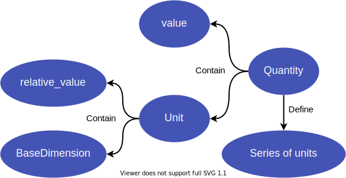

.. _package-intro:

====================
openpd.unit package
====================

The ``openpd.unit`` package is designed to convert unit for both simulation and analysis conveniently. Meanwhile, ``openpd.unit`` also has the constant quantity like the Avogadro constant and the Boltzmann Constant. 

-----------------------------

-----------------------------

As shown above, every ``unit`` exists as an instance of ``Quantity``. This is because we want to achieve that code :code:`1 * unit.nanometer` returns a ``Quantity`` while the ``Unit`` is also an attribute of ``Quantity``. If we define the ``__rmul__`` method of the ``Unit`` returning a ``Quantity`` instance, we will meet the cross import issue.

.. seealso:: :doc:`../../tutorials/howto_useunit/main` tutorial

.. toctree::
    :maxdepth: 1

    baseDimension
    unit
    quantity

.. _predefined-unit:

Pre-defined unit list 
======================

In OpenPD, many frequently used units have already been defined, as shown below. The user can use it with code like:

.. code-block:: python
    :linenos:

    import openpd as pd
    import openpd.unit as unit

    quantity = 1 * unit.nanometer

.. seealso::

    - :ref:`import-style for openpd.unit package <import-unit-package>`
    - :ref:`How to define a custom unit?<self-defined-unit>`

Default unit list 
======================

The default units for each dimension, the relative value of which are not necessary to be ``1``, in OpenPD are shown in table below:

.. table:: 
    :widths: 40 60

    +---------------------+------------------------------------+
    |      Dimension      |                Unit                |
    +=====================+====================================+
    | Length              | ``angstrom``                       |
    +---------------------+------------------------------------+
    | Mass                | ``amu``                            |
    +---------------------+------------------------------------+
    | Time                | ``femtosecond``                    |
    +---------------------+------------------------------------+
    | Temperature         | ``kelvin``                         |
    +---------------------+------------------------------------+
    | Charge              | ``e``                              |
    +---------------------+------------------------------------+
    | Amount of substance | ``mol``                            |
    +---------------------+------------------------------------+
    | Energy              | ``kilojoule_permol``               |
    +---------------------+------------------------------------+
    | Force               | ``kilojoule_permol_over_angstrom`` |
    +---------------------+------------------------------------+
    | Power               | ``watt``                           |
    +---------------------+------------------------------------+

Base units
----------

.. table:: 
    :widths: 20 20 20 

    +----------------+--------------+-----------------+-------------+-------------+---------------------+
    |     Length     |     Mass     |      Time       | Temperature |   Charge    | Amount of substance |
    +================+==============+=================+=============+=============+=====================+
    | ``meter``      | ``kilogram`` | ``second``      | ``kelvin``  | ``coulomb`` | ``mol``             |
    +----------------+--------------+-----------------+-------------+-------------+---------------------+
    | ``decimeter``  | ``gram``     | ``millisecond`` |             | ``e``       | ``kilomol``         |
    +----------------+--------------+-----------------+-------------+-------------+---------------------+
    | ``centimeter`` | ``amu``      | ``microsecond`` |             |             |                     |
    +----------------+--------------+-----------------+-------------+-------------+---------------------+
    | ``micrometer`` | ``dalton``   | ``nanosecond``  |             |             |                     |
    +----------------+--------------+-----------------+-------------+-------------+---------------------+
    | ``nanometer``  |              | ``picosecond``  |             |             |                     |
    +----------------+--------------+-----------------+-------------+-------------+---------------------+
    | ``angstrom``   |              | ``femtosecond`` |             |             |                     |
    +----------------+--------------+-----------------+-------------+-------------+---------------------+

Mixture units
-------------

.. table:: 
    :widths: 3 32 61 4

    +-----------+------------------------+---------------------------------------+--------------+
    | Constants |         Energy         |                 Force                 |    Power     |
    +===========+========================+=======================================+==============+
    | ``n_a``   | ``joule``              | ``newton``                            | ``watt``     |
    +-----------+------------------------+---------------------------------------+--------------+
    | ``k_b``   | ``kilojoule``          | ``kilonewton``                        | ``kilowatt`` |
    +-----------+------------------------+---------------------------------------+--------------+
    |           | ``kilojoule_permol``   | ``kilojoule_permol_over_angstrom``    |              |
    +-----------+------------------------+---------------------------------------+--------------+
    |           | ``calorie``            | ``kilojoule_permol_over_nanometer``   |              |
    +-----------+------------------------+---------------------------------------+--------------+
    |           | ``kilocalorie``        | ``kilocalorie_permol_over_angstrom``  |              |
    +-----------+------------------------+---------------------------------------+--------------+
    |           | ``kilocalorie_permol`` | ``kilocalorie_permol_over_nanometer`` |              |
    +-----------+------------------------+---------------------------------------+--------------+
    |           | ``ev``                 |                                       |              |
    +-----------+------------------------+---------------------------------------+--------------+
    |           | ``hartree``            |                                       |              |
    +-----------+------------------------+---------------------------------------+--------------+
