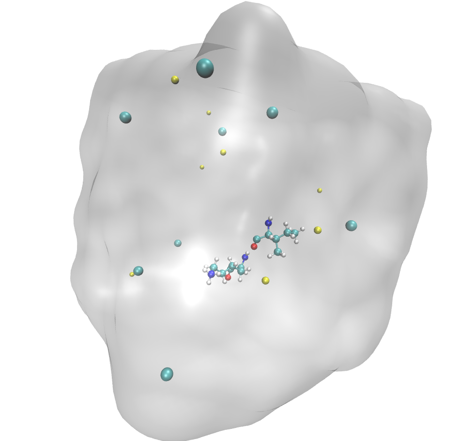

.. _pdff_overview:

==============
PDFF Overview
==============

PDFF, standing for **P**\ eptide **D**\ ynamics **F**\ orce **F**\ ield, is a highly coarse-grained force field that designed for the simulation of kinetics and dynamics of protein folding process, basing on data from All Atom Molecular Dynamics (AAMD) simulation result.

In PDFF, every peptide is considered as two main atoms:

- :math:`C_{\alpha}`: :math:`\alpha` carbon of peptide.
- :math:`SC`: Mass center of the side chain.

The potential energy :math:`U\left(\{q_{i}\}\right)` can be written as:

----------------------------------------------------

.. math::
    
    \begin{array}{rcl}
        \displaystyle U_{tot} &=& \displaystyle U_{Non-Bonded} + U_{Bond} + U_{Torsion} \\\\
        &=& \displaystyle \sum_{i=1}^{N_{A}}\sum_{j=i+1}^{N_{A}} U_{Non-Bonded}^{(ij)}\left(\textbf{r}_{ij}\right)\ +\\\\
        && \displaystyle\sum_{i=1}^{N_{B}} U_{Bond}^{(i)} \left(l_{i}\right)\ +\ \sum_{i=1}^{N_{T}} U_{Torsion}^{(i)} \left(\theta_{i}\right) 
    \end{array}

----------------------------------------------------

, where :math:`N_A`, :math:`N_B`, :math:`N_T` represents the number of atoms, bonds, and torsions, respectively. :math:`U_{interaction}^{(i)}` stands for the :math:`i`\ th interpolation of specific interaction. And :math:`\textbf{r}_{ij}`, :math:`l_i`, :math:`\theta_i` represents the vector from the :math:`SC` atom of :math:`i`\ th peptide to the :math:`SC` atom of :math:`j`\ th peptide, the length of :math:`i`\ th bond, and the torsion angle of :math:`i`\ th torsion.

.. seealso::

    :doc:`Overview of openpd.element.Topology <../modules/element/topology>` for the detail of the construction of PD simulation's topology.

Further, PDFF uses the free energy surface of AAMD model as the potential surface of the coarse-grained PD model. So the interaction and influence of solvent have been included intrinsically in PDFF itself, which means solvent will not be considered in the PD simulation. This fact makes the Degree of Freedom (DoF) of PD simulation much smaller than AAMD or other CGMD.

In PDFF, the potential energy will be implicit interpolations of the origin free energy surface obtained from AAMD simulation instead of explicit expressions like the Lennard-Jones potential or the potential of the harmonic oscillator. This is because the free energy surfaces of different peptides' interaction in AAMD are too diversiform, as the :math:`SC` atoms are much more complicated than a single atom to find a general pattern to describe them properly. In this aspect, interpolations of origin free energy surfaces are a directive and accuracy choice.

In the following sections, the creation of PDFF will be introduced in detail. All of the AAMD simulation is carried by OpenMM :cite:`openmm` with Amber ff14SB :cite:`amberff14sb` force field.

========================
Non-bonded interaction
========================

Introduction
============

PDFF Non-bonded interaction describes the inter-peptides potential energy. Only :math:`SC` is contained in this interaction, while the interaction of :math:`C_{\alpha}` with other :math:`SC` and :math:`C_\alpha` atoms is ignored. In total, :math:`\displaystyle\sum_{i=1}^{20}i = 210` inter-peptide free energy surfaces are contained in PDFF for all the non-bonded interaction between :math:`20` standard peptide.

.. seealso::

    :doc:`Standard Peptide List <../modules/element/peptide>` for the pdff-supported standard peptide list.

AAMD details
============

As the distance between :math:`SC` atoms of two different peptides is a proper collective variable for the PDFF Non-bonded interaction, we use the umbrella sampling (UB) :cite:`umbrella_sampling_init` to obtain the free energy of AAMD model. In each simulation, two peptides are immersed in a :math:`30\times30\times30 A^3` box which is fulfilled by :math:`0.15 mol/L` **NaCl** solution, as shown in the figure below.

-------------------------------------

-------------------------------------

For each peptides-pair, :math:`200` trajectories with different bias potentials, the centers of which spread evenly in :math:`[1, 15] A`, have been obtained, yielding a :math:`500 ns` trajectory in total. The elastic constants for all of the bias potentials are :math:`50 kj/mol\cdot A^2`. Then Weighted Histogram Analysis Method :cite:`wham` (WHAM) is used to get the final free energy surface.

================
Bond interaction
================

======================
Torsion interaction
======================
