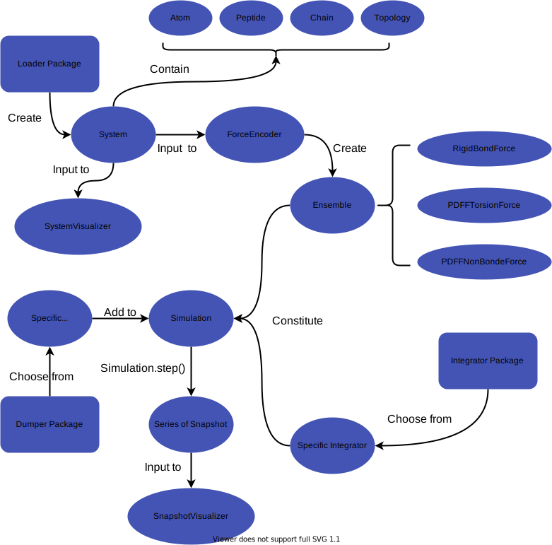

=============
Introduction
=============

Overview
=========

OpenPD is completely written and used in Python as we want it to be as flexible and extensible as possible. When we use a python module, we can also call gazillion of third party modules, like numpy, scipy, and so on, to make our simulation and analysis more convenient and powerful. Meanwhile, the install of python package is more light-weighted than :math:`c^{++}` or :math:`fortran` package.

A typical demo code that loads a PDB file, than creates a ``system``, finally visualizes it is shown below:

.. code-block:: python
   :linenos:

   import openpd as pd 

   # Loading data
   pdb_file = '<path to pdb file>'
   loader = pd.PDBLoader(pdb_file)

   # Creating System
   system = loader.createSystem(is_extract_coordinate=True)

   # Visualization
   visualizer = pd.SystemVisualizer(system)
   visualizer.show()

This code paradigm is very different from the other well-known simulation package whose input files focuses more on the determination of simulation parameters. The OpenPD will only provide the package and class, leaving work and free to the users.

Framework
===========

A lot of class object is created and cooperate with each other to conduct a simulation with OpenPD, which has already shown in the demo code above. 

In this section, we will introduce the framework of how OpenPD is designed and worked. The flowchart is showing below:

.. _image_flowchart:

In above flowchart, the eclipses and rectangles represent classes and packages respectively, all of which are discussed thoroughly in :ref:`module`. 

The ordinary procedure of conducting a simulation with OpenPD can be generalized as:
    1. Creating a ``system`` instance from input file by ``loader`` in ``openpd.loader``.
    #. Creating an ``ensemble`` instance from system by ``ForceEncoder``.
    #. Choosing an ``integrator`` from ``openpd.integrator``.
    #. Combining ``system``, ``ensemble``, and ``integrator`` to create a ``simulation`` instance
    #. Choosing one or several ``dumper`` from ``openpd.dumper``, adding to the ``simulation`` 
    #. Using ``simulation.step(num_steps)`` to run the simulation and collect ``snapshot``