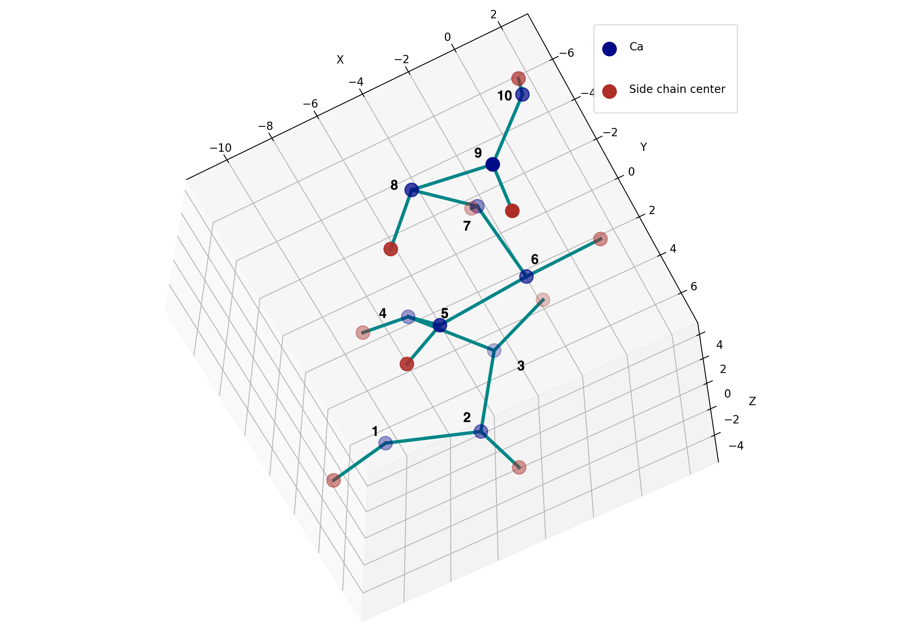
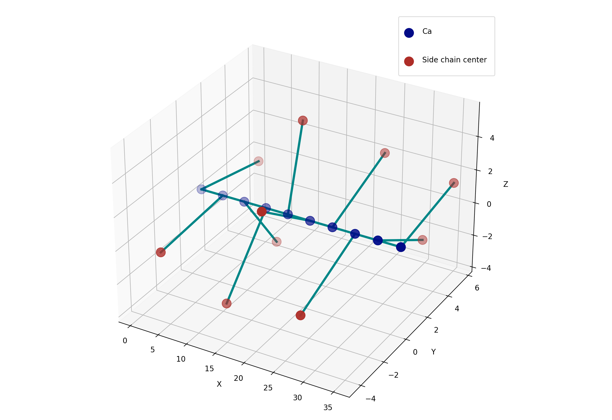
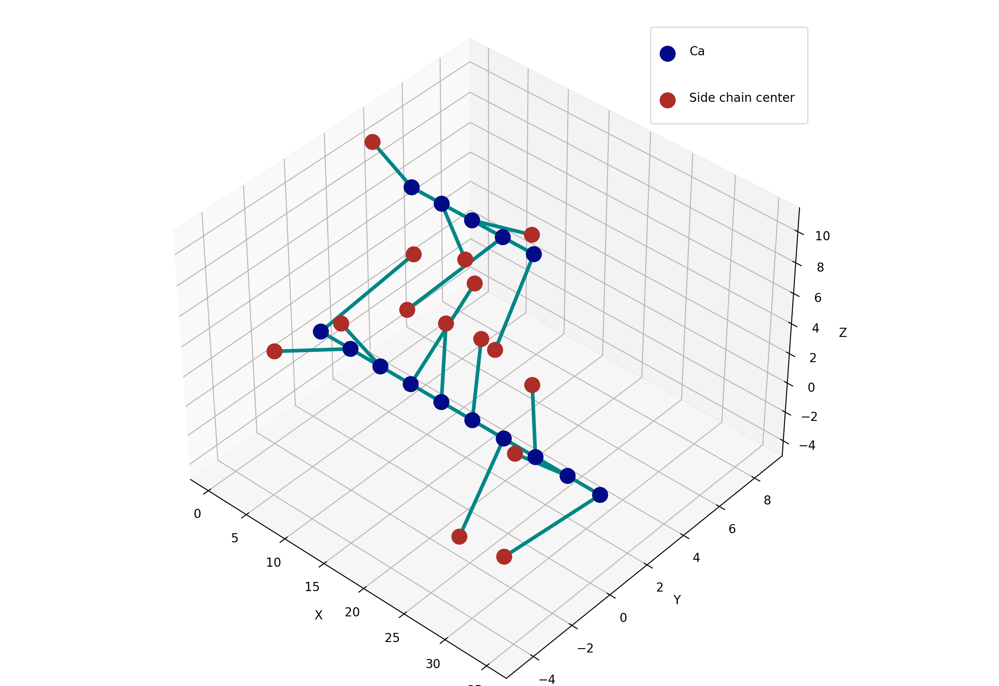

=======================
How to create a system
=======================

Introduction
=============

In OpenPD, the system (or input model) information is stored in the ``System`` instance, which contains one or several ``Chain`` instances and a ``Topology`` instance.

.. note::

    In OpenPD, the ``system`` only contain the **coarse-grained model** that matches the PDFF.

.. seealso::

    - :doc:`../../modules/core/system` page
    - :doc:`../../modules/core/chain` page
    - :doc:`../../modules/core/topology` page
    - :doc:`../../pdff/overview` page
 
``System.chains`` stores the information of peptide  list and other attributes information and ``System.topology`` stores all of the topology information of simulation system, including bonds, angles, and torsions.

OpenPD provides ``openpd.loader`` API to assist in creating the ``system`` automatically. Currently, two loaders are provided for two ordinary occasions:

- ``PDBLoader`` assists in creating a system from a `.pdb` file.
- ``SequenceLoader`` assists in creating a system from a sequence of protein. 

.. seealso::

    - :doc:`../../modules/loader/pdbLoader` page
    - :doc:`../../modules/loader/sequenceLoader` page

This tutorial provides two demo codes and example input files for each ``loader`` to help user get familiar of ``openpd.loader`` package. And we can use ``visualizer.SystemVisualizer`` to visualize the system created by ``loader``.

.. note:: All the code show below can be found in ``<openpd path>/tutorials/example.ipynb``.

.. tip:: Although we still provide an `.ipynb` file as what we do in other tutorials. We also suggest user to copy the demo code to a `.py` file for a better 3D plot interaction.

Using the PDBLoader
====================

For the `.pdb` file, we can use ``openpd.PDBLoader`` to load information and create system. In this section, we use :download:`demo.pdb <../../../../tutorials/data/demo.pdb>` as the input file. It is a sequence of **1l2y trp-cage** protein. We slice the alpha helix part to form the input file.

We first create a ``loader`` instance from the input file:

.. code-block:: python
    :linenos:

    import openpd as pd

    pdb_file = './data/demo.pdb'

    # Load data and create system
    loader = pd.PDBLoader(pdb_file)

Than call the methods ``createSystem`` of ``loader`` to create a ``System`` instance:

.. code-block:: python
    :linenos:

    system = loader.createSystem()

Finally, we use the ``system`` as the input to create a ``SystemVisualizer`` instance to visualize our ``system``:

.. code-block:: python
    :linenos:

    # Visualize result
    visualizer = pd.SystemVisualizer(system)
    visualizer.show()

The result is shown as below:

----------------

----------------

.. note::  The number in the figure is the index of :math:`C_\alpha` atom for a clearer structure illustration.

As we can see, the system only contains the :math:`C_\alpha` **atoms** and the **mass centers of the side chains**, which correspond to the atoms mattered in the PDFF. 

In this system, the ``PDBLoader`` automatically extracts coordinate from the *.pdb* file. In some cases, we only care about the sequence of the protein. Then we can specific ``is_extract_coordinate=False`` to generate a side chain random distributed peptide chain.

.. code-block:: python
    :linenos:

    system = loader.createSystem()

    visualizer = pd.SystemVisualizer(system)
    visualizer.show()

After that, the ``system`` will then be a simple straight peptide chain (like shown below) waiting for PD simulation.

----------------

----------------

In this mode, the distance of :math:`C_\alpha\ -\ C_\alpha` is :math:`3.5 A` and distribute along :math:`x` axis. The distance between the mass center of the side chain (:math:`SC`) and its connected :math:`C_\alpha` is defined by the type of peptide. The :math:`SC\ -\ C_\alpha` bond is parallel to the :math:`YoZ` plane and the degree between :math:`SC\ -\ C_\alpha`  bond and :math:`y` axis is an evenly distributed random number in the range :math:`[-\pi, \pi)`.

Using the SequenceLoader
========================

In most cases, we only know the peptide sequence of the protein that we are interested in. We can also write a simple *.json* file which contains the sequence of the protein as the input file of ``SequenceLoader`` as below:

.. code-block:: json
    :linenos:
    
    {
        "Chain 1": [
            "ASN", "ALA", "ASN", "ALA", "ALA",
            "ASN", "ALA", "ASN", "ALA", "ALA"
        ],
        "Chain 2": [
            "ASN", "ALA", "ASN", "ALA", "ALA"
        ]
    }

.. note::

    Each element that describes the peptide sequence in the *.json* file is a string list whose name starts with **Chain** (case insensitive), like: 

    - "Chain 1"
    - "CHAIN a"
    - "chain #"
  
    The word after **Chain** only plays the role of identification, while the order of chain solely depends on the writing order.

    The elements that do not start with  **Chain** will not be loaded into ``loader``.

.. note::

    Both three letter abbreviation and single letter abbreviation are supported in *.json* file by specific ``pd.SequenceLoader(pdb_file, is_single_letter=True)``. However, mixture styles like 

    .. code-block:: json
        
        {
            "Chain 1": ["ALA", "A"]
        }

    or 

    .. code-block:: json

        {
            "Chain 1": ["ALA", "ASN"],
            "Chain 2": ["A", "S"]
        }
        
    are not supported.

The demo code of using ``SequenceLoader`` has exactly the same paradigm as shown before in ``PDBLoader``:

.. code-block:: python
    :linenos:

    import openpd as pd

    sequence_file = './data/sequence.json'

    # Load data and create system
    loader = pd.SequenceLoader(sequence_file)
    system = loader.createSystem()

    # Visualize result
    visualizer = pd.SystemVisualizer(system)
    visualizer.show()

The difference is the ``SequenceLoader`` can only create a system based on the random generated coordinate as shown below:

----------------

